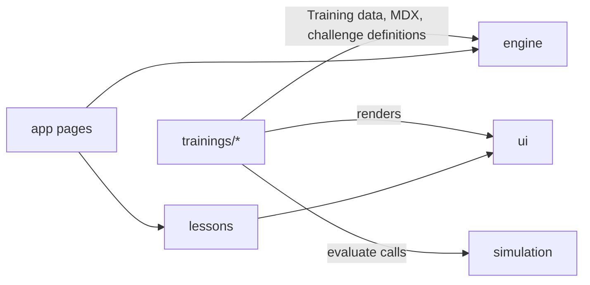

# AI Quest

An interactive, game-like training platform for teaching practical AI concepts to enterprise users.

> **AI Quest does not make LLM calls. All AI behavior shown in the training is simulated deterministically.**
> There are no API keys, no model calls, no external AI dependencies and no paid inference.

The first training is **Token & Context Management**: what tokens are, how context windows work, why more
context is not always better, how to select a model for a task, and what all of this means at enterprise scale.

## Running it

```bash
npm install
npm run dev        # http://localhost:5173
npm test           # Vitest unit tests
npm run typecheck  # strict TypeScript
npm run build      # production build to dist/
npm run preview    # serve the production build
```

Requires Node 20.19+ (developed on Node 26). No environment variables, credentials or backend.

## Architecture

Single Vite + React + TypeScript application with strictly separated modules:

```
src/
├── app/          Shell: catalogue, training overview, lesson page, results, theme, routing
├── engine/       GENERIC training engine: types, progression, quiz scoring, registry, persisted store
├── simulation/   PURE deterministic simulations (tokens, context, models, retrieval, prompts, scenarios)
├── ui/           Reusable interactive components for training authors
├── lessons/      Lesson-type renderers, MDX component map, engagement gating
├── games/        Phaser scenes (lazy-loaded) with React bridges and accessible fallbacks
├── concepts/     Vendor-neutral concept vocabulary + Claude/OpenAI/Gemini/Copilot terminology
└── trainings/    Training content. One folder per training, registered in trainings/index.ts
```



Design rules:

- **The engine is subject-agnostic.** It knows trainings, modules, lessons, challenges, scores, feedback and
  progression. It never imports from `simulation/` or `trainings/`.
- **Simulations are pure functions.** `input → result`, no randomness, no clock, no React. Most tests live here.
- **UI components hold no training state.** They receive props. Lesson renderers read and write the Zustand store.
- **Content is data.** A training is a `Training` object referencing MDX files, interactive components and
  challenge definitions whose `evaluate()` calls the simulation layer.
- **Progress persists in localStorage** (`ai-quest:progress:v1`) via Zustand's `persist` middleware, with an
  in-memory fallback when storage is unavailable. Stored progress is reconciled when a training's lessons change.
- **Learners must engage.** Explanation lessons unlock Continue only after every concept card, reveal,
  comparison and diagram has been explored. Some challenges require several attempts before a failed result
  can be skipped.
- **No network at runtime.** Monaco is bundled locally instead of loaded from a CDN. Phaser and Monaco are
  lazy chunks that load only on the lessons that use them.

## The trainings

| Training | For | Level | About |
| --- | --- | --- | --- |
| **Token & Context Management** (~30 min) | Everyone | Beginner | Tokens, context windows, context selection, model choice, retrieval, enterprise trade-offs. Token Heist, Context Surgeon, Prompt Surgery, Model Selection, AI Adoption Lead. |
| **Claude for Everyday Work** (~20 min) | Everyone | Beginner | Decks and documents without code: chats vs projects, briefing well, usage limits, data safety. Brief Builder, Deck Doctor, Where does it go?, a board-meeting deck. |
| **Claude Code Power User** (~35 min) | Power users | Intermediate | CLAUDE.md, settings layers and permission rules, hooks, skills and subagents, MCP, model routing, long-session hygiene. CLAUDE.md Surgery, Permission Puzzle, Hook Lab, team repo setup. |
| **Building on Claude** (~35 min) | Engineers | Advanced | Prompt caching and batching, agent tool design and least privilege, eval suites, enterprise rollout. Cache Architect, Agent Toolbox, Eval Lab, ship an AI feature. |

The catalogue filters by audience, and the filter is kept in the URL (`/?for=engineer`).

Claude-specific content is written from `docs/sources/claude-facts.md`, a dated fact sheet with a source
link for every claim. Anything that could not be verified is left out. To add a training, see
`docs/ADDING_A_TRAINING.md`.

## Testing

`npm test` runs Vitest. Coverage focuses on the deterministic core:

- **Engine:** progression, unlocking, XP and badges, restart, reconciliation, invalid ids, quiz scoring, store.
- **Simulations:** tokens, context windows and selection, model selection, retrieval, prompt and CLAUDE.md
  rule checks, conversations, briefs, sorting, settings layering, permission matching, hooks, prompt caching,
  workloads, agent runs, eval suites, scenarios and composed final challenges. Each covers ideal, partial and
  failing inputs, edge cases, malformed input and determinism.
- **Challenge definitions:** every challenge in every training with malformed answers and expected
  pass/fail outcomes, including model answers for the editor exercises.
- **Components:** engagement gating, the scenario flow, bucket sorting and ordering keyboard use, and the
  catalogue filter (jsdom).
- **Training data:** every registered training is checked for duplicate lesson ids, quiz answers that exist,
  a scored final lesson and an honest time estimate.

## Deployment

Pushing to `main` builds and deploys to GitHub Pages (`.github/workflows/deploy.yml`). The build writes a
`404.html` copy of the app shell so deep links and page refreshes work on a static host.

## Simulation model

Token counts use an explicit approximation (`tokens ≈ characters / 4`) and every number is labelled as simulated.
Model profiles are fictional. Nothing here reproduces a real tokenizer or real vendor pricing; the point is to
teach resource management and decision-making.
